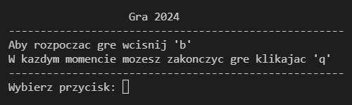
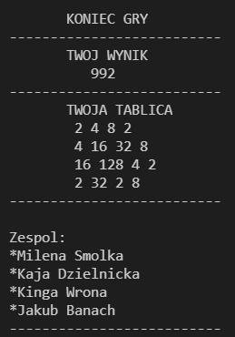

# Kinga Wrona
<p>
     
</p>
### Hi! I'm a 19 years old student and here are some of my the most interesting projects! 


## NEW PROJECT - 2048 game

<p>
     
</p>

[Kaja](https://narzekajka.github.io/)
[Kuba](https://jakubbanach.github.io/)
[Milena](https://milsmo.github.io/)

<p>
     
</p>

## Web - Przekroje figur

[link to the code](https://github.com/kingawr123/web)

```markdown

import * as THREE from 'three';
import { Mesh } from 'three';

//This is exaple of a function that, with help of Three.js, renders a cube

export function addBox() {

  const material = new THREE.MeshBasicMaterial({
    color: 0xFF9900,
    wireframe: true,
  });

  const box = new THREE.Mesh(new THREE.BoxGeometry(4, 4, 4), material);
  box.castShadow = true;

  return box;
}

//Like before, but this one is rendering a cone

export function addCone(){
  const material = new THREE.MeshPhongMaterial({
    color: 0xFF9900,
    shininess: 100,
    wireframe: true,
  });

  var geo = new THREE.ConeGeometry(2,4.5,50);

  var cone = new THREE.Mesh(geo, material);
  cone.position.set(2, 2.5, 2);
  cone.castShadow = true;

  cone.rotation.y = 70;

  return cone
}

```


<!-- ### Jekyll Themes

Your Pages site will use the layout and styles from the Jekyll theme you have selected in your [repository settings](https://github.com/kingawr123/kingawr123.github.io/settings/pages). The name of this theme is saved in the Jekyll `_config.yml` configuration file. -->

## Github 

Here is link to my other projects! --> [github](https://github.com/kingawr123)
